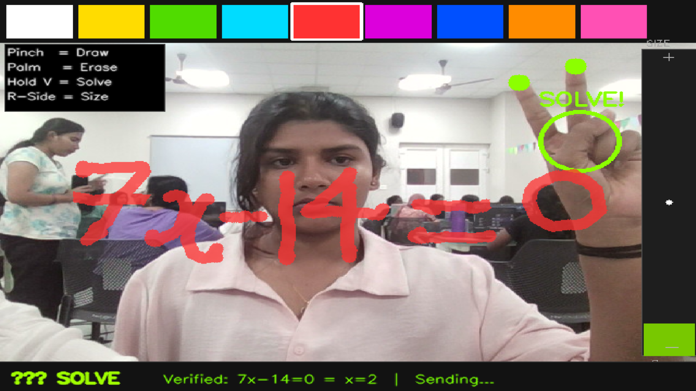
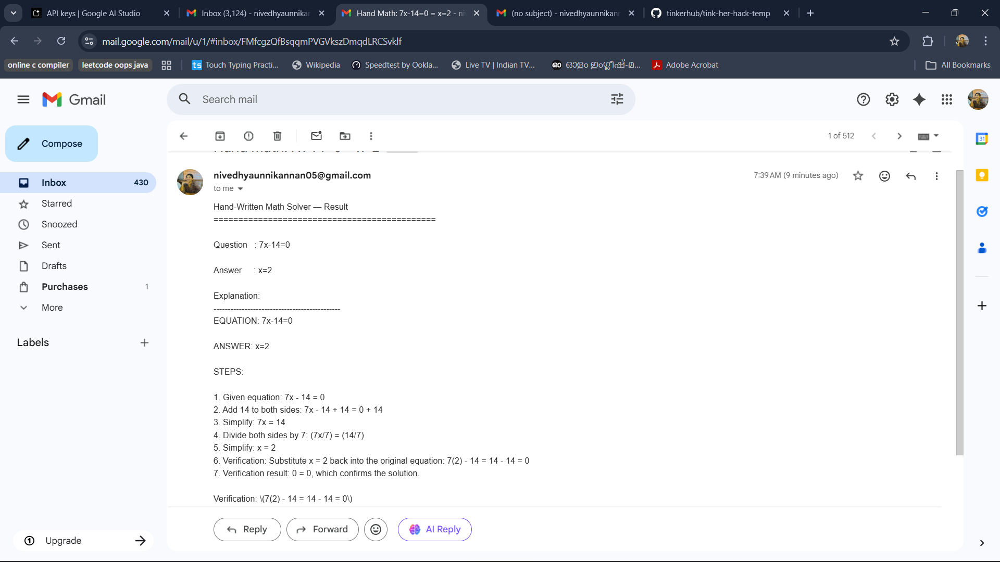
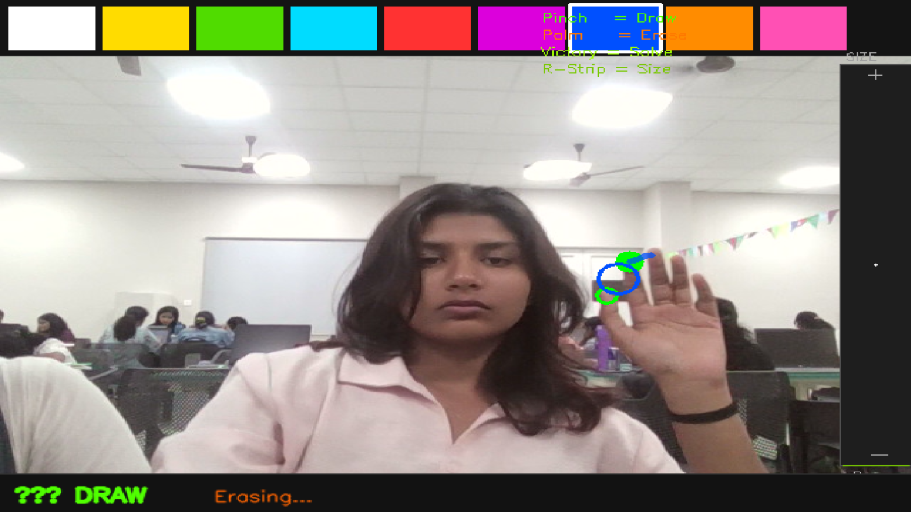

<p align="center">
  
</p>

# AI AIR CANVAS 🎯

## Basic Details

### Team Name: Innovature

### Team Members
- Member 1: Nivedhya Unnikannan - Muthoot Institute of Technology and Science
- Member 2: Amina K A - Muthoot Institute of Technology and Science

### Hosted Project Link
[mention your project hosted link here]

### Project Description
AI Air Canvas is a real time gesture controlled drawing application that lets users draw in the air using hand gestures captured via webcam. Users can write mathematical equations in the air, trigger an AI solver to compute the answer instantly, and automatically receive the verified solution directly to their registered email all without touching a keyboard or mouse.

### The Problem statement
Traditional learning and problem-solving tools require physical input devices like keyboards, mice, or styluses. There is no intuitive, hands-free way to sketch ideas or solve math problems on screen, making interactive learning less engaging and inaccessible for touchless environments.


### The Solution
AI Air Canvas uses computer vision and hand tracking to detect specific gestures from a live webcam feed. Users can draw freely in the air using a pinch gesture, erase with a palm gesture, change brush sizes, pick colors, and trigger an AI-powered math solver just by holding a "V" sign making learning interactive, fun, and completely hands-free.

---

## Technical Details

### Technologies/Components Used

**For Software:**
- Languages used: python
- Frameworks used: OpenCV
- Libraries used: MediaPipe (hand landmark detection),NumPy,Groq API / AI Solver integration, smtplib (automated email delivery of solutions)


- Tools used: VS Code, Git, Webcam/Camera input

**For Hardware:**
- Main components: [List main components]
- Specifications: [Technical specifications]
- Tools required: [List tools needed]

---

## Features

List the key features of your project:
- Feature 1:  Gesture-Based Drawing:** Use a pinch gesture to draw freely on a virtual canvas overlaid on your live camera feed.

- Feature 2: Air Eraser:** Open your palm to instantly erase parts of your drawing — no button clicks needed.
- Feature 3:AI Math Solver:** Hold up a "V" sign to trigger the AI solver, which reads your handwritten equation and displays the verified solution in real time (e.g., `7x - 14 = 0 → x = 2`).

- Feature 4:Color Palette & Brush Size:** Choose from 9 colors via the top palette bar, and adjust brush size using right-side gestures for precise or bold strokes.

-Feature 5:Auto Email Solution:** Once the AI solves the equation, the verified result is automatically sent to the user's registered email ID — so you never lose your solutions.


---

## Implementation

### For Software:

#### Installation
```bash
# Clone the repository
git clone https://github.com/your-username/ai-air-canvas.git
cd ai-air-canvas

# Install required dependencies
pip install -r requirements.txt
```


#### Run

```bash
python app.py
```

> Make sure your webcam is connected and accessible before running the application.

---


### For Hardware:

#### Components Required
[List all components needed with specifications]

#### Circuit Setup
[Explain how to set up the circuit]

---

## Project Documentation

### For Software:

#### Screenshots (Add at least 3)


_Drawing mode — User writing the equation `7x - 14 = 0` in the air using pinch gesture with red color selected._


_Solve gesture detected — "V" hand sign triggers AI solver; result `x = 2` displayed at the bottom of the screen._


_Color palette at the top of the screen with 9 color options; gesture controls overlay shown in the top-left corner._


#### Diagrams

**System Architecture:**


The application captures live video frames from the webcam using OpenCV. Each frame is passed to MediaPipe's hand tracking module, which identifies 21 hand landmarks in real time. Based on the relative positions of key landmarks (index finger tip, thumb tip, etc.), the system classifies the current gesture — pinch (draw), palm (erase), V-sign (solve), or right-side movement (resize brush). Drawing strokes are overlaid directly onto the video frame using NumPy canvas layers. When the solve gesture is detected, the canvas content is sent to the integrated AI model (Gemini API), which interprets the handwritten equation and returns a verified solution, displayed at the bottom of the screen. Simultaneously, the solution is automatically dispatched to the user's registered email ID via smtplib, as seen by the "Sending..." status in the UI.


**Application Workflow:**


*Add caption explaining your workflow*
```
Webcam Input
     ↓
OpenCV Frame Capture
     ↓
MediaPipe Hand Landmark Detection
     ↓
Gesture Classification
  ├── Pinch → Draw on Canvas
  ├── Palm → Erase Canvas
  ├── Hold V → Send to AI Solver → Display Solution → 📧 Email Solution to User
  └── R-Side → Adjust Brush Size
     ↓
Overlay Canvas on Live Video Feed
     ↓
Display Output to User
```

---

### For Hardware:

#### Schematic & Circuit


*Add caption explaining connections*


*Add caption explaining the schematic*

#### Build Photos


*List out all components shown*


*Explain the build steps*


*Explain the final build*

---

## Additional Documentation

### For Web Projects with Backend:

#### API Documentation

**Base URL:** `https://api.yourproject.com`

##### Endpoints

**GET /api/endpoint**
- **Description:** [What it does]
- **Parameters:**
  - `param1` (string): [Description]
  - `param2` (integer): [Description]
- **Response:**
```json
{
  "status": "success",
  "data": {}
}
```

**POST /api/endpoint**
- **Description:** [What it does]
- **Request Body:**
```json
{
  "field1": "value1",
  "field2": "value2"
}
```
- **Response:**
```json
{
  "status": "success",
  "message": "Operation completed"
}
```

[Add more endpoints as needed...]

---

### For Mobile Apps:

#### App Flow Diagram


*Explain the user flow through your application*

#### Installation Guide

**For Android (APK):**
1. Download the APK from [Release Link]
2. Enable "Install from Unknown Sources" in your device settings:
   - Go to Settings > Security
   - Enable "Unknown Sources"
3. Open the downloaded APK file
4. Follow the installation prompts
5. Open the app and enjoy!

**For iOS (IPA) - TestFlight:**
1. Download TestFlight from the App Store
2. Open this TestFlight link: [Your TestFlight Link]
3. Click "Install" or "Accept"
4. Wait for the app to install
5. Open the app from your home screen

**Building from Source:**
```bash
# For Android
flutter build apk
# or
./gradlew assembleDebug

# For iOS
flutter build ios
# or
xcodebuild -workspace App.xcworkspace -scheme App -configuration Debug
```

---

### For Hardware Projects:

#### Bill of Materials (BOM)

| Component | Quantity | Specifications | Price | Link/Source |
|-----------|----------|----------------|-------|-------------|
| Arduino Uno | 1 | ATmega328P, 16MHz | ₹450 | [Link] |
| LED | 5 | Red, 5mm, 20mA | ₹5 each | [Link] |
| Resistor | 5 | 220Ω, 1/4W | ₹1 each | [Link] |
| Breadboard | 1 | 830 points | ₹100 | [Link] |
| Jumper Wires | 20 | Male-to-Male | ₹50 | [Link] |
| [Add more...] | | | | |

**Total Estimated Cost:** ₹[Amount]

#### Assembly Instructions

**Step 1: Prepare Components**
1. Gather all components listed in the BOM
2. Check component specifications
3. Prepare your workspace

*Caption: All components laid out*

**Step 2: Build the Power Supply**
1. Connect the power rails on the breadboard
2. Connect Arduino 5V to breadboard positive rail
3. Connect Arduino GND to breadboard negative rail

*Caption: Power connections completed*

**Step 3: Add Components**
1. Place LEDs on breadboard
2. Connect resistors in series with LEDs
3. Connect LED cathodes to GND
4. Connect LED anodes to Arduino digital pins (2-6)

*Caption: LED circuit assembled*

**Step 4: [Continue for all steps...]**

**Final Assembly:**

*Caption: Completed project ready for testing*

---

### For Scripts/CLI Tools:

#### Command Reference

**Basic Usage:**
```bash
python script.py [options] [arguments]
```

**Available Commands:**
- `command1 [args]` - Description of what command1 does
- `command2 [args]` - Description of what command2 does
- `command3 [args]` - Description of what command3 does

**Options:**
- `-h, --help` - Show help message and exit
- `-v, --verbose` - Enable verbose output
- `-o, --output FILE` - Specify output file path
- `-c, --config FILE` - Specify configuration file
- `--version` - Show version information

**Examples:**

```bash
# Example 1: Basic usage
python script.py input.txt

# Example 2: With verbose output
python script.py -v input.txt

# Example 3: Specify output file
python script.py -o output.txt input.txt

# Example 4: Using configuration
python script.py -c config.json --verbose input.txt
```

#### Demo Output

**Example 1: Basic Processing**

**Input:**
```
This is a sample input file
with multiple lines of text
for demonstration purposes
```

**Command:**
```bash
python script.py sample.txt
```

**Output:**
```
Processing: sample.txt
Lines processed: 3
Characters counted: 86
Status: Success
Output saved to: output.txt
```

**Example 2: Advanced Usage**

**Input:**
```json
{
  "name": "test",
  "value": 123
}
```

**Command:**
```bash
python script.py -v --format json data.json
```

**Output:**
```
[VERBOSE] Loading configuration...
[VERBOSE] Parsing JSON input...
[VERBOSE] Processing data...
{
  "status": "success",
  "processed": true,
  "result": {
    "name": "test",
    "value": 123,
    "timestamp": "2024-02-07T10:30:00"
  }
}
[VERBOSE] Operation completed in 0.23s
```

---

## Project Demo

### Video
[Add your demo video link here - YouTube, Google Drive, etc.]

*Explain what the video demonstrates - key features, user flow, technical highlights*

### Additional Demos
[Add any extra demo materials/links - Live site, APK download, online demo, etc.]

---

## AI Tools Used (Optional - For Transparency Bonus)

If you used AI tools during development, document them here for transparency:

**Tool Used:** [e.g., GitHub Copilot, v0.dev, Cursor, ChatGPT, Claude]

**Purpose:** [What you used it for]
- Example: "Generated boilerplate React components"
- Example: "Debugging assistance for async functions"
- Example: "Code review and optimization suggestions"

**Key Prompts Used:**
- "Create a REST API endpoint for user authentication"
- "Debug this async function that's causing race conditions"
- "Optimize this database query for better performance"

**Percentage of AI-generated code:** [Approximately X%]

**Human Contributions:**
- Architecture design and planning
- Custom business logic implementation
- Integration and testing
- UI/UX design decisions

*Note: Proper documentation of AI usage demonstrates transparency and earns bonus points in evaluation!*

---

## Team Contributions

- Nivedhya Unnikannan: Hand gesture detection, MediaPipe integration, canvas rendering
- Amina K A:  AI solver integration, UI overlay, color palette & brush controls

---

## License

This project is licensed under the [LICENSE_NAME] License - see the [LICENSE](LICENSE) file for details.

**Common License Options:**
- MIT License (Permissive, widely used)
- Apache 2.0 (Permissive with patent grant)
- GPL v3 (Copyleft, requires derivative works to be open source)

---

Made with ❤️ at TinkerHub# AI Air Canvas 🎯
